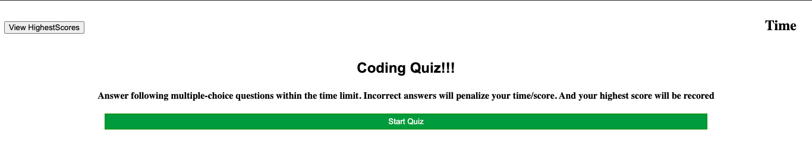
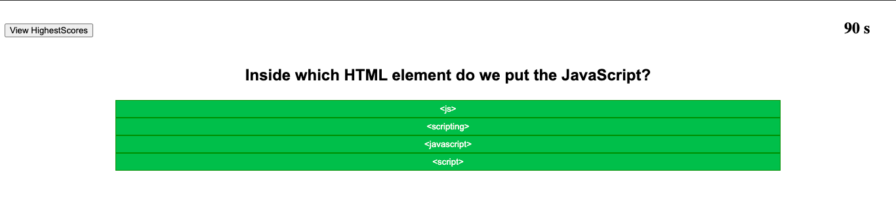
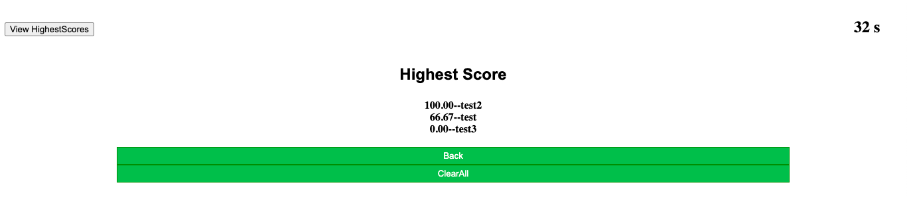
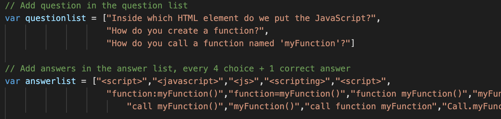

# CodeQuiz
A timed coding quiz with multiple-choice questions\
[Index](./index.html)

# Finished Requirements
Click the start button to start the quiz\
A timer starts and I am presented with a question\
WHEN I answer a question\
THEN I am presented with another question\
Answer a question incorrectly\
Time is subtracted from the clock\
All questions are answered or the timer reaches 0\
The quiz is over\
I can save my initials and my score\

Questions can be added in the js file\
Answers for each question will be shuffled when start again\
Scoreboard will list scores from highest to lowerest

\
\
\

# Instruction of adding questions, and answers
User can add/delete questions\
score for each question will be calculated evenly\
\
For example:\
questionlist = ['question1',\
                'question2',\
                'question3',\
                'question4',\
                .\
                .\
                .           ]\
                
answerlist = ['question1option','question1option','question1option','question1option','question1ans',\
              'question2option','question2option','question2option','question2option','question2ans',\
              'question3option','question3option','question3option','question3option','question3ans',\
              .\
              .\
              .                                                                                       ]

# Generator GitHub site
[Github Site](https://sg3606.github.io/CodeQuiz/.)